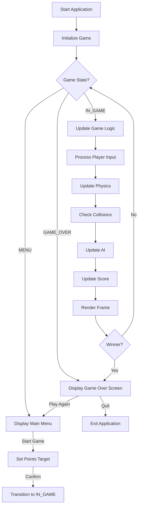
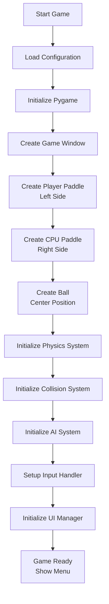
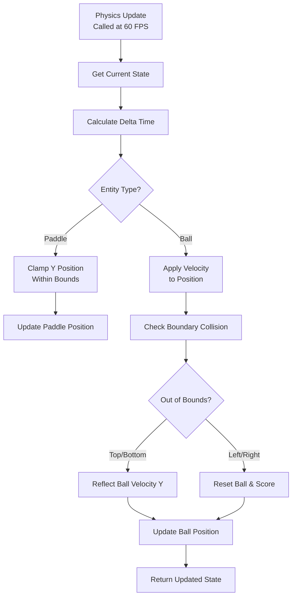
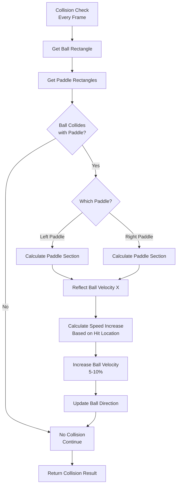
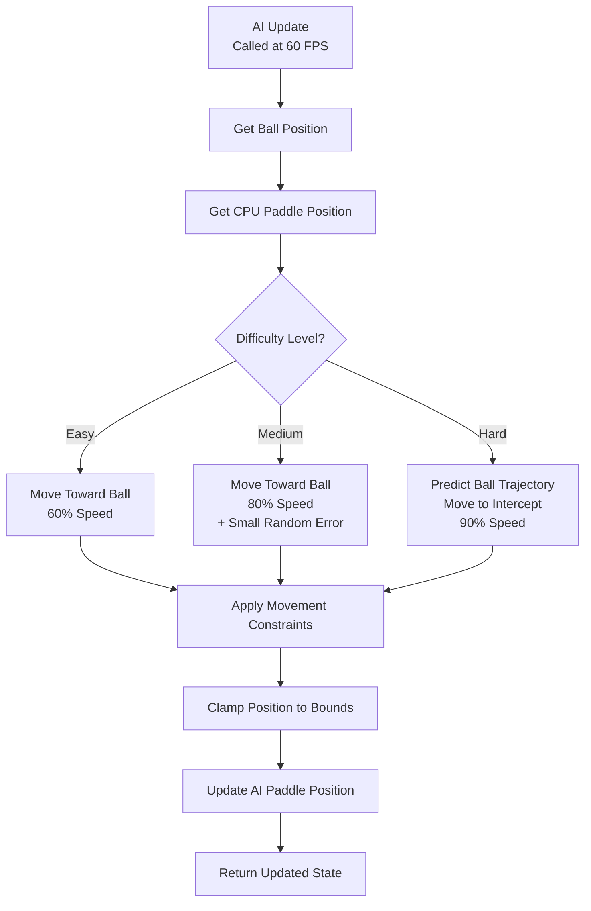
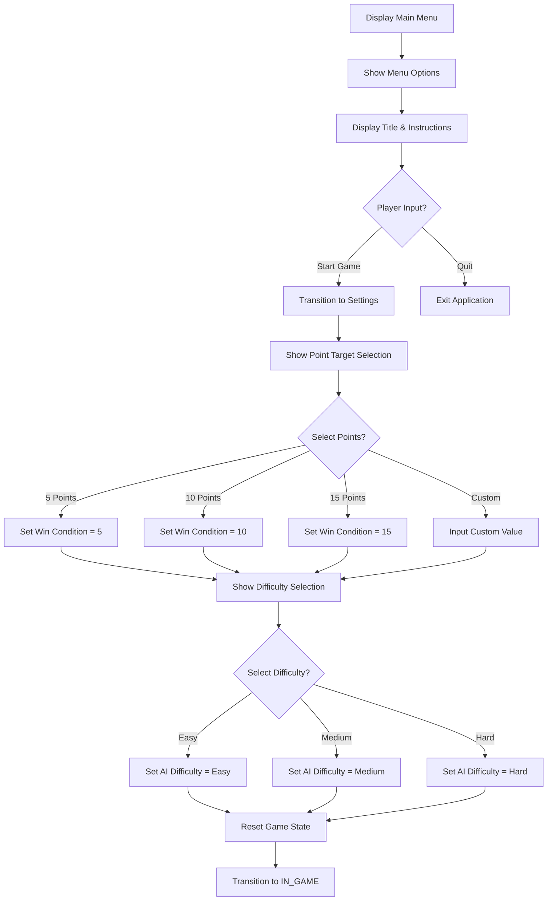
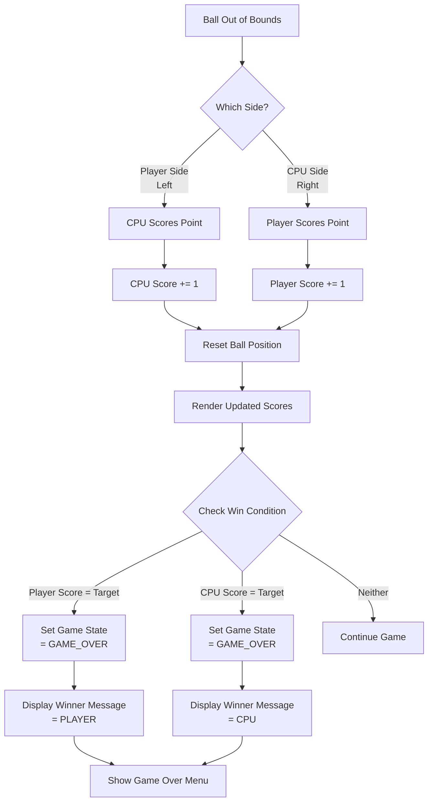
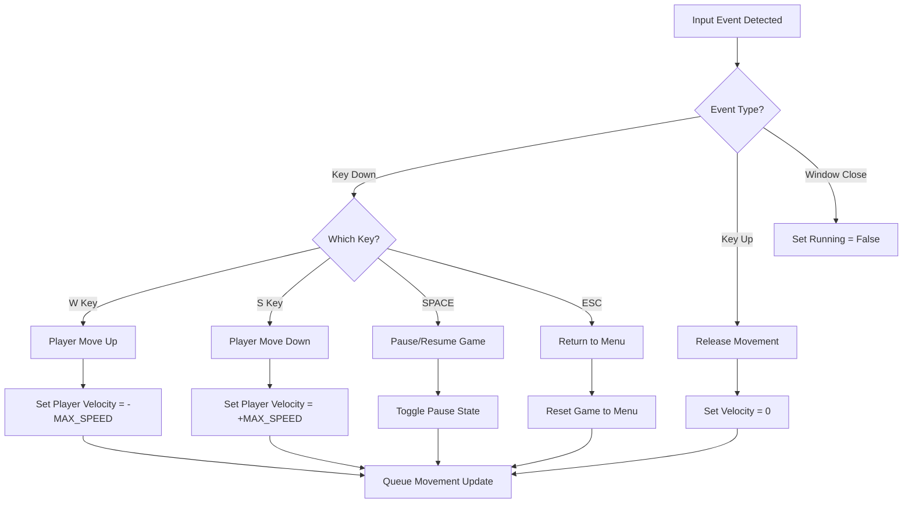
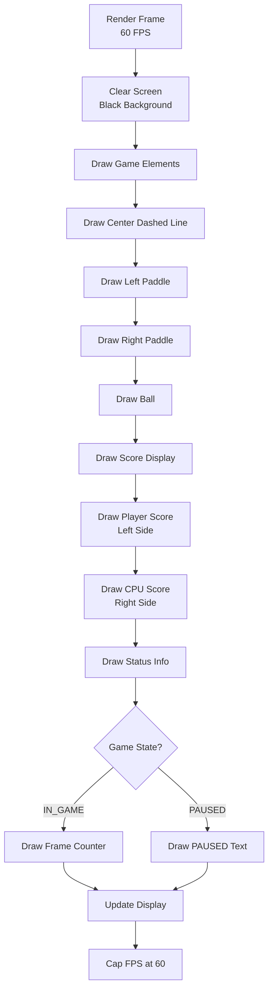
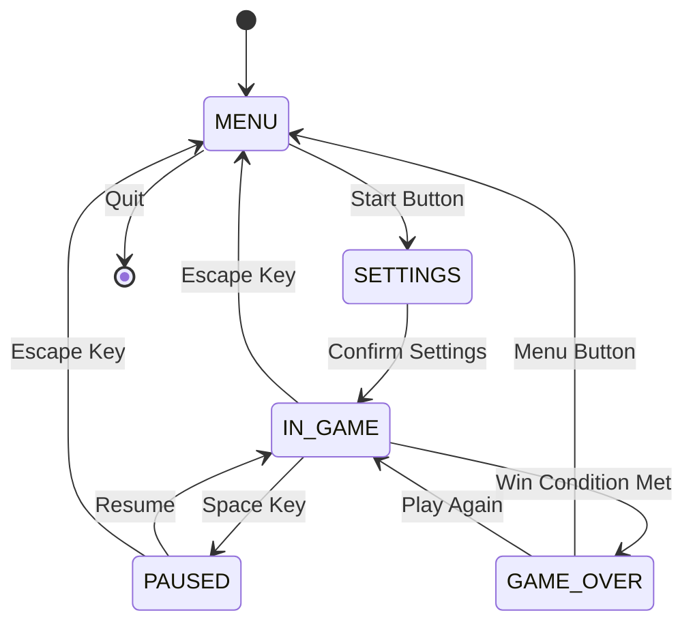

# PONG Game - Flow Diagrams

## 1. Main Game Loop Flow

## 2. Game Initialization Flow

## 3. Physics & Movement System

## 4. Collision Detection & Response

## 5. AI Decision Making Flow

## 6. Main Menu Flow

## 7. Score & Win Condition Flow

## 8. Input Handling Flow

## 9. Frame Rendering Flow

## 10. Game States Diagram

